# Advanced Concepts

[back to dag authoring page](https://github.com/KattsonBastos/astro-airflow-certification/tree/main/fundamentals)

<p align="justify">
&ensp;&ensp;&ensp;&ensp;Sometime we'll have a DAG with a lot of tasks that, for the same input, they do the same thing. For example, for three databases, we'll load the data, make some transformations and, then, load into a DW. Will we have to create one different operator for each task of each database? Actually, there's no need for that. In this section we'll see how to better approach this solution.
</p>

<a name="readme-top"></a>

<p id="contents"></p>

## Contents
- <a href="#dynamic_tasks">Not So Dynamic DAGs</a>
- <a href="#branching">Branching Operator: choosing between tasks</a>
- <a href="#trigger_rules">Trigger Rules</a>
- <a href="#deps_helpers">Dependencies and Helpers</a>
- <a href="#pools">Pools: dealing with tasks resource consuming</a>
- <a href="#critical_tasks">Task Priority: executing critical tasks first, the others after</a>
- <a href="#past_dep">Dependency on Past: when a task needs the output of its previous execution</a>

---
<p id="dynamic_tasks"></p>
  
## Not So Dynamic DAGs

<p align="justify">
&ensp;&ensp;&ensp;&ensp;Even though nowadays Airflow has a more sofisticated way of creating tasks dynamically, for this certification we're going to take a look at a simples way: iterating over a dictionary and creating the tasks. Let's better understand that. Suppose we want to create the following DAG:
</p>

<p align='center'>
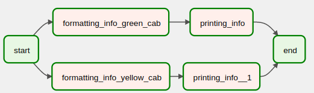
</p>

<p align="justify">
&ensp;&ensp;&ensp;&ensp;Basically, we have taxi driver info, such as name, last name, and age, and we want to create a pipeline that reads that data, formats them and then prints them. The thing is that we want to do that for green and yellow taxi drivers. Usually, we could implement 4 operators, 2 per cab. However, there's no need for that. Let's first take a look at what DAG we could create. You can check the DAG file <a href="https://github.com/KattsonBastos/astro-airflow-certification/blob/main/dag_authoring/astro/dags/not_so_dynamic_tasks.py
">here</a>.
<br>
&ensp;&ensp;&ensp;&ensp;The first thing we'll need is a dictionary. Consider the following:
</p>

```python
taxis = {
    "green_cab": {
        "driver_first_name": "Astro",
        "driver_last_name": "Nomer",
        "driver_age": 1
    },
    "yellow_cab": {
        "driver_first_name": "Air",
        "driver_last_name": "Flow",
        "driver_age": 2
    }
}

```

<p align="justify">
&ensp;&ensp;&ensp;&ensp;Here we could have any configuration we wanted. For simplicity, we considered just one driver info per cab.
<br>
&ensp;&ensp;&ensp;&ensp;The next step is to define the tasks and the DAG. We'll have two tasks:
</p>

```python
# task defitnition
@task.python(task_id=f"formatting_info_{taxi_cab}", multiple_outputs=True)
    def formatting_info(fisrt_name, last_name):
        full_name = fisrt_name + last_name

        return {"full_name": full_name.title()}


@task.python
def printing_info(full_name, age):

    print(f"{full_name['full_name']} has {age} years!")

```

<p align="justify">
&ensp;&ensp;&ensp;&ensp;The first task receives driver's first and last name, then concat them, and, finally, returns it. The second task only prints that concatenated name and the drivers's age. you can notice in the referenced file that the first task is inside the for loop in the DAG. That's because we wanted to create a specific ID for the formatting task. in order to differenciate.
</p>

```python
# dag definition
@dag(catchup=False, schedule=None, default_args=default_args, max_active_runs=1)
def taxi_driver_info():

    start = EmptyOperator(task_id="start")
    end = EmptyOperator(task_id="end")

    for taxi_cab, driver_info in taxis.items():
        
        #formatting task
        @task.python(task_id=f"formatting_info_{taxi_cab}", multiple_outputs=True)
        def formatting_info(fisrt_name, last_name):
            full_name = fisrt_name + last_name

            return {"full_name": full_name.title()}

        
        driver_name_full_name = formatting_info(
            driver_info['driver_first_name'], 
            driver_info['driver_last_name']
        )

        chain(
            start,
            driver_name_full_name, 
            printing_info(driver_name_full_name, driver_info['driver_age']), 
            end
        )


dag = taxi_driver_info()

```

<p align="justify">
&ensp;&ensp;&ensp;&ensp;That's it. The general idea of creating dynamic tasks is as simple as that. One thing we have to keep in mind is that Airflow only create dynamic tasks if it already knows whats the input (the dictionary). That is, it can't create tasks dynamically from the output of another task. That's because we're calling it <strong>not so dynamic</strong> (latest versions have a more sophisticated way of doing this).
</p>

<p align="right">(<a href="#readme-top">back to top</a>)</p>

---

<p id="branching"></p>
  
## Branching Operators: choosing between tasks

<p align="justify">
&ensp;&ensp;&ensp;&ensp;Branching allows us to choose between tasks according to some condition we specify. There are a lot of branching operators
</p>

- **BranchPythonOperator**: choosing a task according the task_id returned by a python function.
- **BranchSQLOperator**: choosing a task according to a value in a SQL table.
- **BranchDateTimeOperator**: choosing a task according to given timeframes.
- **BranchDayOfWeekOperator**: choosing a task according to the current date.

<p align="justify">
&ensp;&ensp;&ensp;&ensp;In this section, we'll briefly look at the BranchPythonOperator. Take a look at the following graph:
</p>

<p align='center'>
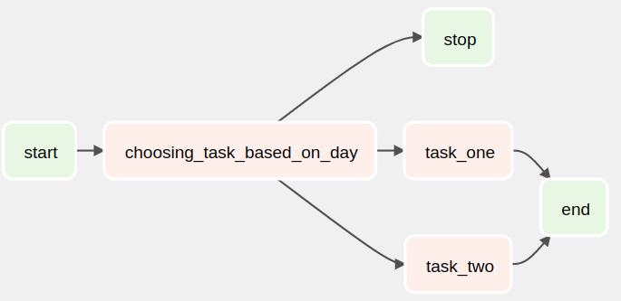
</p>

<p align="justify">
&ensp;&ensp;&ensp;&ensp;Basically, it will execute task_one on mondays, tuesdays, and wednesdays; task_two on thursdays, fridays, and saturdays; otherwise, it stopps. You can find the entire code <a href="https://github.com/KattsonBastos/astro-airflow-certification/blob/main/dag_authoring/astro/dags/branching_operator_example.py
">here</a>. First, we implemented the tasks and the conditioning function:
</p>

```python
# task defitnition
@task.python
def task_one():

    print("I'm the first")


@task.python
def task_two():

    print("I'm the second")


def _choosing_task_based_on_day(execution_date):
    today_day = execution_date.day_of_week

    if (today_day in (1,2,3)):
        return 'task_one'
    
    elif (today_day in (4,5,6)):
        return 'task_two'
    
    else:
        return 'stop'

```

<p>
&ensp;&ensp;&ensp;&ensp;In this case, we're branching based on the execution date. Then, we are able to implement the DAG. Notice that just by returning the task id it automatically choose the corresponding task for us.
</p>

```python
# dag definition
@dag(catchup=False, schedule=None, default_args=default_args, max_active_runs=1)
def chooser_dag():

    start = EmptyOperator(task_id="start")
    end = EmptyOperator(task_id="end")
    stop = EmptyOperator(task_id="stop")

    choosing_task_based_on_day = BranchPythonOperator(
        task_id='choosing_task_based_on_day',
        python_callable=_choosing_task_based_on_day
    )

    start >> choosing_task_based_on_day >> stop
    chain(start, choosing_task_based_on_day, [task_one(), task_two()], end)

dag = chooser_dag()

```

<p>
&ensp;&ensp;&ensp;&ensp;So beautiful, isn't it? So, let's execute the DAG. After some seconds, we'll see the following:
</p>

<p align='center'>
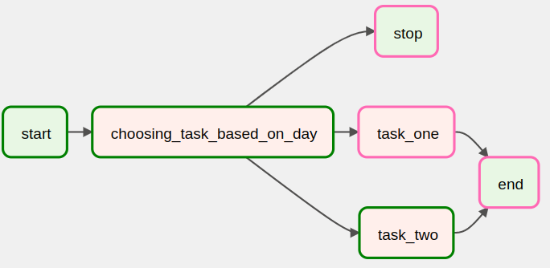
</p>

<p>
&ensp;&ensp;&ensp;&ensp;😯 It skipped the 'end' task, even though the task_two was succesfully executed. But, why? 🤔
<br>
&ensp;&ensp;&ensp;&ensp;That's where the concept of Trigger Rules comes into place. Well, a task is ging to be executed based on upstream execution status. So, we can choose to execute a task whether the upstream skipped, failed, succeed, and so on. In order to fix our code and execute the 'end' task in case task_one or task_two have succeeded, we have to add the following argument to the task:
</p>

```python
#end = EmptyOperator(task_id="end")
end = EmptyOperator(task_id="end", trigger_rule='none_failed_or_skipped')

```

<p>
&ensp;&ensp;&ensp;&ensp;Now we have the desired output.
</p>

<p align='center'>
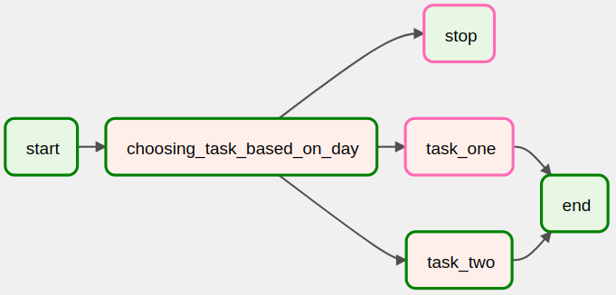
</p>


<p align="right">(<a href="#readme-top">back to top</a>)</p>

---
<p id="trigger_rules"></p>
  
## Trigger Rules

<p>
&ensp;&ensp;&ensp;&ensp;Trigger Rules define the behavior of our tasks: how it is going to be triggered. By default, the trigger rule of a task is 'all_success', that means our task will be executed only if all its parents have succeeded. We have other options for task trigerring:
</p>

<p align="center">
<table>
<thead>
  <tr>
    <th>Trigger Rule</th>
    <th>Description</th>
  </tr>
</thead>
<tbody>
  <tr>
    <td>all_success</td>
    <td>(default) all parents have succeeded..</td>
  </tr>
  <tr>
    <td>all_failed</td>
    <td>all parents are in a failed or upstream_failed state.</td>
  </tr>
  <tr>
    <td>all_done</td>
    <td>all parents are done with their execution.</td>
  </tr>
  <tr>
    <td>one_failed</td>
    <td>fires as soon as at least one parent has failed, it does not wait for all parents to be done.</td>
  </tr>
  <tr>
    <td>one_success</td>
    <td>fires as soon as at least one parent succeeds, it does not wait for all parents to be done</td>
  </tr>
  <tr>
    <td>none_failed</td>
    <td>all parents have not failed (failed or upstream_failed) i.e. all parents have succeeded or been skipped.</td>
  </tr>
  <tr>
    <td>none_skipped</td>
    <td>no parent is in a skipped state, i.e. all parents are in a success, failed, or upstream_failed state</td>
  </tr>
  <tr>
    <td>none_failed_or_skipped </td>
    <td>(berfore Airflow 2.2) no parent have failed and at least one have succeeded.</td>
  </tr>
  <tr>
    <td>dummy</td>
    <td>aadependencies are just for show, trigger at willa</td>
  </tr>
</tbody>
</table>
</p>


<p align="right">(<a href="#readme-top">back to top</a>)</p>

---
<p id="deps_helpers"></p>
  
## Dependencies and Helpers

<p>
&ensp;&ensp;&ensp;&ensp;Depending on our use case, managing dependencies between tasks could be a little hard. COnsider the following DAG example:
</p>

```python
# imports
from datetime import datetime
from airflow.decorators import dag
from airflow.operators.empty import EmptyOperator

# dag definition
@dag(catchup=False, schedule=None, start_date=datetime(2023,1,1))
def dep_dag():

    t1 = EmptyOperator(task_id='t1')
    t2 = EmptyOperator(task_id='t2')
    t3 = EmptyOperator(task_id='t3')

    t4 = EmptyOperator(task_id='t4')
    t5 = EmptyOperator(task_id='t5')
    t6 = EmptyOperator(task_id='t6')

dep_dag()

```

<p>
&ensp;&ensp;&ensp;&ensp;How should we specify the dependencies in case both t4, t5 and t6 depends on t1, t2 and t3? That is, t4 will have dependencies on all t1,t2 and t3 (the same for t5 and t6), something like this:
</p>

<p align='center'>
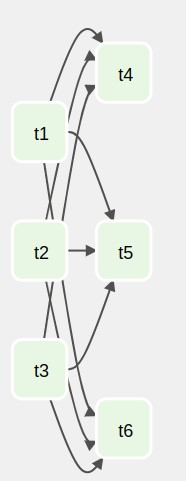
</p>

<p>
&ensp;&ensp;&ensp;&ensp;Maybe we could do the following:
</p>

```python
[t1, t2, t3] >> [t4, t5, 6]

```

<p>
&ensp;&ensp;&ensp;&ensp;Not good. Airflow will return an error saying it cannot set dependencies between list. What about this one:
</p>

```python
[t1, t2, t3] >> t4
[t1, t2, t3] >> t5
[t1, t2, t3] >> t6

```

<p>
&ensp;&ensp;&ensp;&ensp;That actually works. however, that's a lot or work just for setting dependencies, isn't it? Airflow brings a more sophisticated way of doing that: cross_downstream. Basically, we just have to do the following:
</p>

```python
cross_downstream([t1, t2, t3], [t4, t5, t6])

```

<p>
&ensp;&ensp;&ensp;&ensp;What if we wanted to add task at the beginning and another at the end of the DAG, something like this:
</p>

<p align='center'>
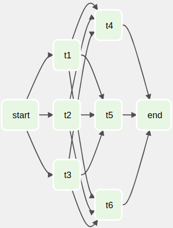
</p>

<p>
&ensp;&ensp;&ensp;&ensp;Is there an easy of of doing it? Yes, there is!! Here another function comes in handy: chain. Chain allows to set dependencies just like the bitwise (>>), but in a much more sophisticated way. Just for example:
</p>

```python
# t1 >> t2 >> t3
chain(t1, t2, t3)

```

<p>
&ensp;&ensp;&ensp;&ensp;In this way, the last image graph can be created with the following code:
</p>

```python
cross_downstream([t1, t2, t3], [t4, t5, t6])
chain(start, [t1, t2, t3], [t4, t5, t6], end)

```

<p align="right">(<a href="#readme-top">back to top</a>)</p>

---
<p id="dynamic_tasks"></p>
  
## Concurrency

<p>
&ensp;&ensp;&ensp;&ensp;A very important concept in Airlfow is the concurrency, because with it we can configure how many tasks, DagRuns, and so on will be executed at the same time. In Airflow, we can set those configurations at the Airflow level (using a configuration file), at teh DAG level or at the task level, when definin it. First, let's take a look at what parameters we can specify in the config file
</p>

- **paralellism** (default: 32): the number of tasks that can be executed at the same time <strong>in our entire Airflow instance</strong>.
- **dag_concurrency** (default: 16): the number of tasks that can be executed at the same time <strong>for a given DAG</strong>.
- **max_active_runs_per_dag** (default: 16): the number of DagRuns that can be executed at the same time <strong>for a given DAG</strong>.


<p>
&ensp;&ensp;&ensp;&ensp;At the DAG level (when defining the DA), we can specify two parameters:
</p>

- **concurrency**: the number of tasks that can be executed at the same time <strong>across all DagRuns</strong> of that DAG.
- **max_active_runs**: the number of DagRuns that can be executed at the same time for that DAG.


<p>
&ensp;&ensp;&ensp;&ensp;At the task level we also have two parameters:
</p>

- **task_concurrency**: the number of executions of that task at the same time <strong>across all DagRuns</strong> of that DAG.
- **pool**: limiting the number of parallel tasks using a pool. We'll see more in the next section.

<p align="right">(<a href="#readme-top">back to top</a>)</p>

---
<p id="pools"></p>
  
## Pools: dealing with tasks resource consuming

<p>
&ensp;&ensp;&ensp;&ensp;What if we have tasks in our DAG that we want to run once per time and others that can be run at the same time? To better ilustrates this, consider the following example. Supose we have a Machine Learing pipeline:
</p>

<p align='center'>
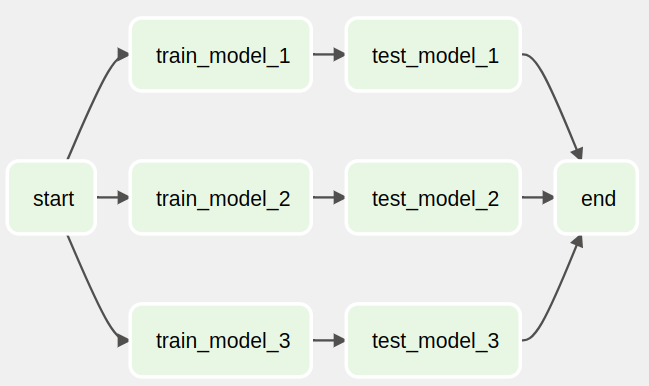
</p>

<p>
&ensp;&ensp;&ensp;&ensp;Usually, ML model training consumes a lot of resources. So, executing them at the same time could be a good idea. On the other hand, testing don't usually consumes too many resources. So, those tasks can be executed at the same time. How can we set these rules? Simple, by using pools.
<br>
&ensp;&ensp;&ensp;&ensp;A pool has a number of worker slots and a running task takes one of that slots untill it gets completed. By default, all tasks runs on the same pool, called default_pool. In the UI, navigating to Admin -> Pools we can see the available pool list. The default pool is there with the following default values:
</p>

<p align='center'>
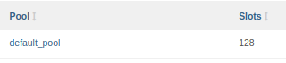
</p>

<p>
&ensp;&ensp;&ensp;&ensp;So, to solve our previous problem, we can create a pool with only one slot and set it to our tasks. To create a pool, jsut go to Admin -> Pools, and then create in the add button. Type something like this:
</p>

<p align='center'>
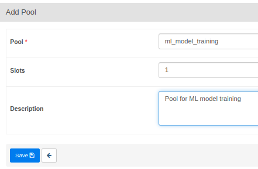
</p>

<p>
&ensp;&ensp;&ensp;&ensp;Good. Now we just have to add the created pool to our task. It's something like this:
</p>

```python
@task.python(task_id="train_model_1", pool="ml_model_training")

```

<p>
&ensp;&ensp;&ensp;&ensp;Then we just have to trigger our DAG and check the execution. You'll se it will run one training task at a time. The remains with the 'scheduled' status.
</p>

<p align='center'>
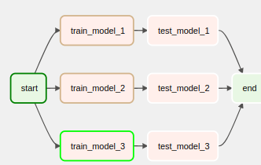
</p>

<p>
&ensp;&ensp;&ensp;&ensp;Another useful pool functionality in Airflow is the number of slots a task will take. The thing is that the pool need to have at least the number of pools we specified. The use is simple:
</p>


```python
@task.python(task_id="loading_data", pool="loading_data_pool", pool_slots=4)

```

<p>
&ensp;&ensp;&ensp;&ensp;Finally, the last thing about pools is that if we're using SubDagOperator and we want to specify a pool to its tasks, we have to pass the parameters to all tasks in the sub dag.
</p>

<p align="right">(<a href="#readme-top">back to top</a>)</p>

---
<p id="critical_tasks"></p>
  
## Task Priority: executing critical tasks first, the others after

<p>
&ensp;&ensp;&ensp;&ensp;In a case where we have a data pipeline that contains critical tasks, or a task that needs to be executed first for any reason, or, yet, a DAG that we want to execute first when some resource is available, is it possible to specify the priority. That's what's we'll see in this section.
<br>
&ensp;&ensp;&ensp;&ensp;To deal with this setting in Airflow we only have to set and manage the piority weight parameters in the task definition. That is, if we have three tasks, we can set a priority weight to each of them. The higher this number is, the higher the priority. Let's see a simple example:
</p>

```python
@task.python(task_id='task_one', priority_weight=3)
def task_one():
  print('Hi!')


@task.python(task_id='task_two', priority_weight=1)
def task_two():
  print('Hi!')


@task.python(task_id='task_three', priority_weight=2)
def task_three():
  print('Hi!')

```

<p>
&ensp;&ensp;&ensp;&ensp;In this case, task_one will be executed first, then the task_three and, finally, the task_two. But there's an important thing here. the priorities are evaluated at the pool level, that is, having different tasks in different pools, the task priorities won't be evaluated.
</p>

<p align="right">(<a href="#readme-top">back to top</a>)</p>

---
<p id="past_dep"></p>
  
## Dependency on Past: when a task needs the output of its previous execution

<p>
&ensp;&ensp;&ensp;&ensp;Let's suppose our task deppends on its previous execution.That is, it will be triggered if and only if the previous execution succeeded. In Airflow all operators have a parameters to specify this behavior: depends_on_past. This parameter can be used in only one task of our DAG or even in all tasks.
<br>
&ensp;&ensp;&ensp;&ensp;To better understand it, let's consider the following example. Suppose we have a DAG with three tasks and the second task depends on past. Also, suppose we have triggered our DAG twice: in the first execution, task two failed. What do you thing is going to happen to that task two in the second DagRun? Well, no errors will appear, it just won't be triggered at all.
</p>

<p align='center'>
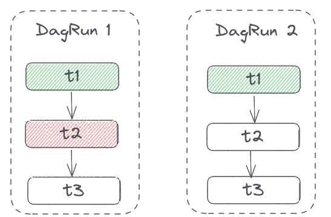
</p>

<p>
&ensp;&ensp;&ensp;&ensp;In the image above, since task one has not past dependenycy, it was triggered regardless of the previous execution status.
<br>
&ensp;&ensp;&ensp;&ensp;An argument we can use together with past dependency is the 'wait_for_downstream'. It means the current task will be triggered only if the previous execution and its direct downstream have succeeded. Let's consider the previous example again, but this time the dependency is on the previous execution and the the downsteam task (task three). The image bellow ilustrates this:
</p>

<p align='center'>
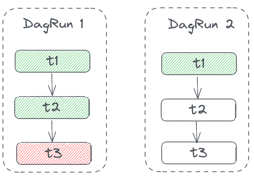
</p>

<p>
&ensp;&ensp;&ensp;&ensp;In this case, even though the previous execution of task_two has succeed, it didn't get triggred. Why? Well, in this example we setted the wait for downstream (which is the task_three), that in turn failed. So, task_two has no status:.
</p>

<p align="right">(<a href="#readme-top">back to top</a>)</p>