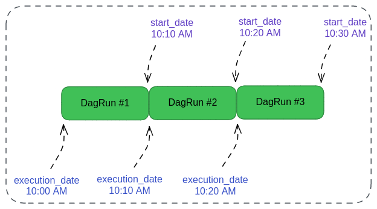

# The Basics

[back to dag authoring page](https://github.com/KattsonBastos/astro-airflow-certification/tree/main/fundamentals)

<p align="justify">
&ensp;&ensp;&ensp;&ensp;In this section we'll learn how to define DAGs, their schedule interval and backfilling.
</p>

<p id="contents"></p>

## Contents
- <a href="#key">Key Notes about DAG files</a>
- <a href="#way">The Right Way of Defining DAGs</a>
- <a href="#scheduling">DAG Scheduling 101</a>

---
<p id="key"></p>
  
## Key Notes about DAG files

[back to contents](#contents)

<p align="justify">
&ensp;&ensp;&ensp;&ensp;An important thing to know, before we get started, is that the Airflow's Scheduler will only parse a .py file (inside our DAGs folder) to check whether it is a DAG or not only if it contains the word 'dag' or 'airflow' inside. Otherwise, Airflow won't generate our DAGs dinamically. Thus, just by importing the DAG class in our .py file the Scheduler will understand it is a DAG.
<br>

&ensp;&ensp;&ensp;&ensp;To modify this behavior, we have to set the 'DAG_DISCOVERY_SAFE_MODE' to false in Airflow's configuration. In this way, it'll try to parse all files.
</p>

<p align="justify">
&ensp;&ensp;&ensp;&ensp;Another important thing to keep in mind is if we have other Python files or other folders in the DAGs folder, we can add a '.airflowignore' in order to avoid Scheduler from trying to parse them. In that file, we can pass any file, folder or extension we don't want to parse.
</p>

---
<p id="way"></p>
  
## The Right Way of Defining DAGs

[back to contents](#contents)


<p align="justify">
&ensp;&ensp;&ensp;&ensp;There are a lot of ways we can define our DAG. The first way is by using the python's context manager `with` as follows:
</p>

```python
from airflow import DAG

with DAG(...) as dag:
    DummyOperator()
```

<p align="justify">
&ensp;&ensp;&ensp;&ensp;The second way is by creating a DAG object and passing it as an argument to all operators:
</p>

```python
from airflow import DAG

dag = DAG(...)

DummyOperator(dag=dag)
```

<p align="justify">
&ensp;&ensp;&ensp;&ensp;This method has the disadvantage that we have to pass the `dag=dag` in all operators we're going to use, that is, for all of our tasks, we'll have to specify that each of them belong to the DAG.
</p>

<p align="justify">
&ensp;&ensp;&ensp;&ensp;The third way we can define a DAG is by using the dag decorator from TaskFlow. It is a new DAG writing paradigm introduced in Airflow 2.0 and and we'll better discuss it later.
</p>

```python
from airflow.decorators import dag

@dag(...)
def user_to_gcs():
    DummyOperator(dag=dag)
```

<p align="justify">
&ensp;&ensp;&ensp;&ensp;Whatever method we choose, there're some parameters we need to specify when defining a DAG:
</p>

- **dag_id**: unique idetifier of our DAG (across all of our DAG in the Airflow instance). If we have two DAGs defined with the same id, no errors will be displayed. However, the UI will display one of the two DAGs randomly (without checking the code or the diagram, we won't know which DAG it is displaying)
- **description**: a parameter we can use to explain what's the goal of the DAG. Even though it is not required, it is a best practice to pass an argument to it.
- **start_date**: it is an option argument used by the scheduler when trying to backfill. Even though it is optional, Airflow needs a start date be in the DAG definition, be in the task. Otherwise we'll have errors. When passing a start date to the DAG, it'll be applied to all of its tasks.
- **schedule_interval** (deprecated since version 2.4) or **schedule**: basically, to defined the trigger frequency of our DAG. As an argument, we can pass both a cron string, a timedelta object, a timtable.
- **dagrun_timeout**: to failed the DagRun if it takes more than the passed time to complete. There's no default value for this parameters.
- **tags**: a pretty useful argument we can use to set tags to a DAG in order to facilitate DAG search & filtering in the UI. It is important to pass meaningful tags related to the business the DAG is related and the operation it does.
- **catchup**: to automatically catchup passed non triggered DagRuns. Let's suppose we stopped the DAG for two days. Once we start it again, if `catchup` is setted to True, all non triggered runs of those two days will be triggered.

<p align="justify">
&ensp;&ensp;&ensp;&ensp;It follows bellow an example of a DAG definition with the above parameters:
</p>

```python
from airflow import DAG
from datetime import datetime, timedelta

with DAG(
    dag_id='user_s3_gcs_transfer',
    description='DAG in charge of transfering user data from S3 to GCS',
    start_date=datetime(2023,1,1),
    #schedule_interval="@daily",
    schedule="@daily",
    dagrun_timeout=tiemdelta(minutes=5),
    tags = ['s3', 'gcs', 'transfer'],
    catchup=False
) as dag:
    DummyOperator()
```

---
<p id="scheduling"></p>
  
## DAG Scheduling 101

<p align="justify">
&ensp;&ensp;&ensp;&ensp;In order to properly schedule our DAGs we have to appropriate deal with two important parameters in the DAG definition:
</p>

- **start_date** (python's datetime object): the date at which our DAG starts being scheduled. In other words, it is the date we want to start scheduling the DAG.
- **schedule** or **scheduling_interval** (deprecated since version 2.4): the interval from the start_date at which the DAG is triggered. We can used both a cron expression or a datetime's timedelta object.

<p align="justify">
&ensp;&ensp;&ensp;&ensp;It is important to keep the following sentence in mind: The DAG [X] starts being scheduled from the start_date and will be triggered <strong>after every schedule_interval</strong>. In order to summarize, let's keep it in the following:
</p>

```
triggered_date = start_date + schedule_interval
```

<p align="justify">
&ensp;&ensp;&ensp;&ensp;Before we finish this section, let's consider an example. Suppose we have a DAG with a start_date at 10:00 AM and a schedule interval every 10 minutes. Here is a little confusion part of Airflow. Once the DAG is triggered at 10:10 AM (as we saw, start_date + schedule_interval, which is 10:00 AM + 10 minutes), the 10:00 becomes the <strong>execution_date</strong> of the running DagRun. Once the DagRun finishes its execution, the 10:10 AM becomes the start_date of the next DagRun and nothing happens until 10:20, when the second DagRun is effectively triggered. For this DagRun, 10:10 AM becomes it execution date and then, once it finishes, 10:20 AM becomes the start_date of the third DagRun, and so on.
</p>

<p align="justify">
&ensp;&ensp;&ensp;&ensp;The following image ilutrates that start_date/schedule_interval dynamics:
</p>


