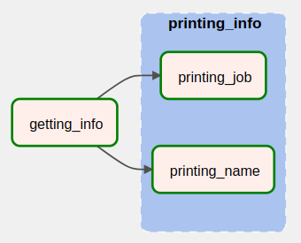
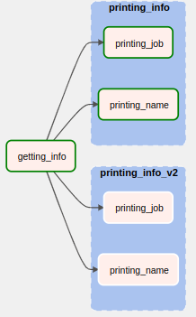
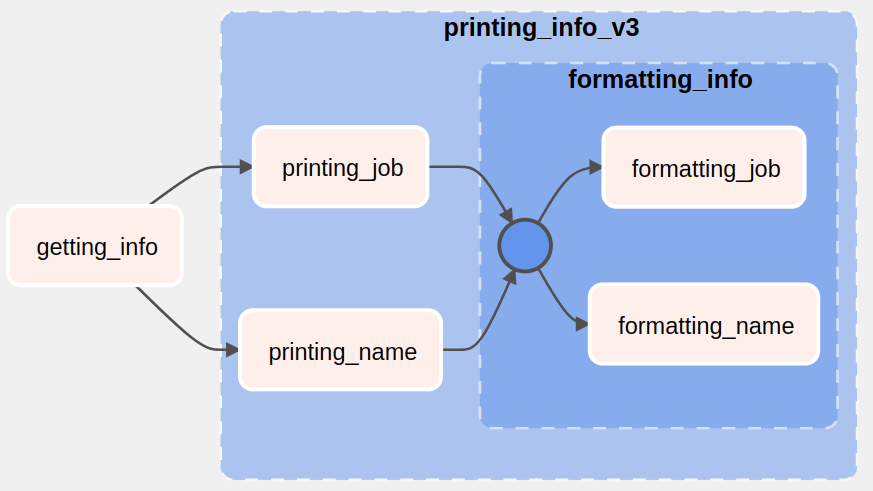

# Grouping Tasks

[back to dag authoring page](https://github.com/KattsonBastos/astro-airflow-certification/tree/main/dag_authoring)

<p align="justify">
&ensp;&ensp;&ensp;&ensp;Sometimes we end up with a lot of tasks inside our DAG, becoming hard to understand what's happening in the DAG. A good way to make it cleaner could be grouping tasks that are related to each other. Airflow allows us to do that, and we can do it in two different ways. In this section We'll brieflly take a look at them.
</p>

<a name="readme-top"></a>

<p id="contents"></p>

## Contents
- <a href="#subdags">SubDags: grouping DAGs with the hard way</a>
- <a href="#taskrgoup">TaskGroup: the best way of grouping our tasks</a>


---
<p id="subdags"></p>
  
## SubDags: grouping DAGs with the hard way

<p align="justify">
&ensp;&ensp;&ensp;&ensp;A SubDAG is basically a DAG inside another DAG. Airflow brings an operator that allows us to work with the SubDAG: SubDagOperator. We must use it with a factory function, a python function to create and return dags. The main DAG code should look like this:
</p>


```python
# imports
from datetime import datetime
from airflow.operators.subdag import SubDagOperator
from subdag_tools.subdag_factory import subdag_factory
from airflow.decorators import task, dag

default_args ={
    "start_date": datetime(2023,1,1),
    "catchup": False,
}

@task.python
def task_zero():

    person_name = "Astronomer"

    return {"person_name": person_name}


# dag definition
@dag(default_args=default_args)
def my_dag():

    saying_hello = SubDagOperator(
        task_id="saying_hello",
        subdag=subdag_factory("my_dag", "saying_hello", default_args),
        poke_interval=30
    )

    task_zero() >> saying_hello


dag = my_dag()

```


<p align="justify">
&ensp;&ensp;&ensp;&ensp;The 'factory_function' is a function we created in another file and it looks like this:
</p>

```python
from airflow.models import DAG
from airflow.decorators import task

@task.python
def task_one():
    
    print('Hi')


def subdag_factory(parent_dag_id, subdag_dag_id, default_args):
    with DAG(f"{parent_dag_id}.{subdag_dag_id}", default_args=default_args) as dag:

        task_one()
    
    return dag


```

<p align="justify">
&ensp;&ensp;&ensp;&ensp;We have to make sure the dag_id of the subdag is going to be the parent_dag_id.subdag_dag_id, otherwise it won't work. Notice that we're sharing default arguments between the two DAGs. That's because we have to make sure they have the same start date.
<br>
&ensp;&ensp;&ensp;&ensp;We have also to make sure there are no dependencies between a task from the main DAG and another task from the SubDAG: we'll get an error. For example, if we would like to use the person_name (returned from the task_zero) inside task_one or task_two, the first idea could be to pass it as a parameter to the subdag_factory function. 
<br>
&ensp;&ensp;&ensp;&ensp;However, Airflow does not allow us to do that. The right way of doing it was to use current execution context. That is, we should update our subdag code to the following: 
</p>


```python
from airflow.models import DAG
from airflow.decorators import task
from airflow.operators.python import get_current_context


@task.python
def task_one():
    ti = get_current_context()['ti']

    person_name = ti.xcom_pull(key='person_name', task_ids='task_zero', dag_id='my_dag')
    
    print('Hi, ', person_name)


def subdag_factory(parent_dag_id, subdag_dag_id, default_args):
    with DAG(f"{parent_dag_id}.{subdag_dag_id}", default_args=default_args) as dag:

        task_one()
    
    return dag

```

<p align="justify">
&ensp;&ensp;&ensp;&ensp;The SubDAG operator is a sensor behind the scene, so it waits the tasks inside to complete before it moves on. So, we can specify a poke_interval.
</p>

<p align="justify">
&ensp;&ensp;&ensp;&ensp;A lot of work, isn't it? By doing so, we'll get the desired output. However, we could have done with a simpler way. That's what we're going to see in the next section.
</p>


<p align="right">(<a href="#readme-top">back to top</a>)</p>

---
<p id="taskrgoup"></p>
  
## TaskGroup: the best way of grouping our tasks

<p align="justify">
&ensp;&ensp;&ensp;&ensp;With Taskgroup it's easier to group tasks: we won't have to care anymore with some details, such as XCOMs sharing, default arguments, or creating a new DAG. Now, there's no need to put DAGs inside of another DAG. Tasks are going to visually be together.
<br>
&ensp;&ensp;&ensp;&ensp;To use it, it's easy. We just have to import the class, instanciate it, specifying a group id, and then adding the tasks. So simple, right? Consider the following snippet:
</p>

```python
# imports
from datetime import datetime
from airflow.decorators import task, dag
from airflow.utils.task_group import TaskGroup

default_args ={
    "start_date": datetime(2023,1,1),
}

@task.python(task_id="getting_info", do_xcom_push=False, multiple_outputs=True)
def getting_info():

    person_name = "Astronomer"

    person_job = "Airflow"

    return {"person_name": person_name, "person_job": person_job}


@task.python#(task_id="printing_name")
def printing_name(person_name):
    
    print('Hi, ', person_name)


@task.python#(task_id="printing_job")
def printing_job(person_job):
    
    print('Your job: ', person_job)


# dag definition
@dag(catchup=False, schedule=None, default_args=default_args)
def tf_dag():

    person_info = getting_info()

    with TaskGroup(group_id="printing_info") as printing_info:


        printing_name(person_info['person_name'])
        printing_job(person_info['person_job'])


dag = tf_dag()

```

<p align="justify">
&ensp;&ensp;&ensp;&ensp;Basically, we created a group of two tasks. The first one prints the person's name; the second, the person's job. Notice that we didn't even need to specify the dependencies between them: it is automatically setted to us. It was also easier to use XCOMs: we just returned the value and passed as a parameter to the subgroup tasks. We ended with the following pipeline:
</p>

<p align='center'>

</p>


<p align="justify">
&ensp;&ensp;&ensp;&ensp;In order to keep our DAG cleaner as possible, a TaskGroup can be imported from another file, the same way we can do with tasks. In this way, we could move the above task group code to another file, inside a function, and import it. In order to better visualize, you can check the DAG <a href="https://github.com/KattsonBastos/astro-airflow-certification/blob/main/dag_authoring/astro/dags/taskflow_example.py
">here</a> and the taskgroup file <a href="https://github.com/KattsonBastos/astro-airflow-certification/blob/main/dag_authoring/astro/dags/groups/other_printer_gp.py
">here</a>. We kept the above example with the adition of a second group. That is, in the same DAG, we can have taskgroups defined inside the dag and another taskgroup imported from another file. Follows the graph:
</p>

<p align='center'>

</p>

<p align="justify">
&ensp;&ensp;&ensp;&ensp;What if we wanted a group inside a group? That's also possible. All we have to do is to instanciate another TaskGroup inside the first TaskGroup (you can see the code <a href="https://github.com/KattsonBastos/astro-airflow-certification/blob/main/dag_authoring/astro/dags/groups/other_printer_gp.py
">here</a>). The graph looks like this:
</p>

<p align='center'>

</p>

<p align="justify">
&ensp;&ensp;&ensp;&ensp;There we can see how beautiful TaskFlow is. In this way, we can create as much nested task groups as we need.
</p>

<p align="right">(<a href="#readme-top">back to top</a>)</p>

