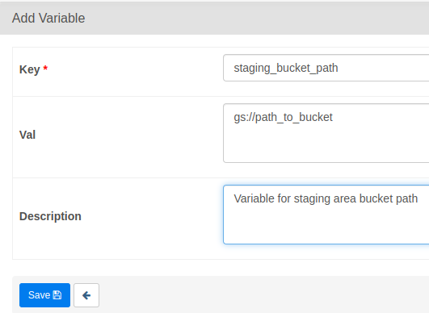
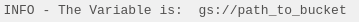
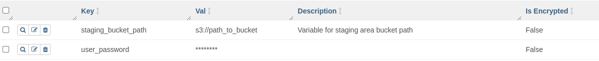
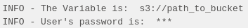
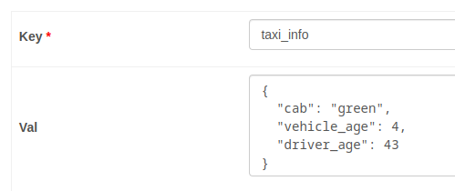

# Mastering Variables

[back to dag authoring page](https://github.com/KattsonBastos/astro-airflow-certification/tree/main/dag_authoring)

<p align="justify">
&ensp;&ensp;&ensp;&ensp;Let's suppose we have multiple pipelines that use, let's say, the same GCS bucket. Should we put the bucket name inside all of our DAGs? That would be a such bad idea, since if for some reason we need to change the bucket path, we should edit DAG by DAG. So, what's the solution for this problem? That's where Airlfow's Variables come in. In this section we'll talk a little bit about them.
</p>

<a name="readme-top"></a>

<p id="contents"></p>

## Contents
- <a href="#variables">Variables</a>
- <a href="#envs">Environment Variables</a>

---
<p id="variables"></p>
  
## Variables

[back to contents](#contents)

<p align="justify">
&ensp;&ensp;&ensp;&ensp;Variables are basically an object of key-value pair stored in the metadata database. So, we can store variables such as an API endpoint, a bucket name, and so on, in a manner that when changed, they're are automatically applied to the entire Airflow instance. That brings us a lot of flexibility when dealing with that repeated information.
<br>
&ensp;&ensp;&ensp;&ensp;Creating a variable is as simple as the following. Just navegate to the Airflow UI, adn then <strong>Admin</strong>-><strong>Variables</strong>. Then, we just have to click on the a new record button and it will open a form so we can insert a key, a value and a description, as shows the following image.
</p>

<p align="center">

<p>

<p align="justify">
&ensp;&ensp;&ensp;&ensp;Creating variables through the UI is just one way of doing that. We can also create them using the Rest API and the CLI. So, once the variable is created, how could we fetch it in a DAG? It is as simple as the following:
</p>

```python
from airflow.models import Variable

staging_bucket_path = Variable.get("staging_bucket_path")
```

<p align="justify">
&ensp;&ensp;&ensp;&ensp;Let's image for some reason we had to change our staging area from Google Cloud Storage to AWS S3. Since we're using a variable, we don't have to change anything in the code, we just have to change the variable's value.
</p>

### Sensitive Variables
<p align="justify">
&ensp;&ensp;&ensp;&ensp;And if we had some sensitive variable, such as a password, an API KEY, is there a way to hide it? The answer is: Yees!! Airflow have some key words we can use in the variable name and it automatically hides the variable value in the UI and in the logs.
<br>
&ensp;&ensp;&ensp;&ensp;Just for you know, if we print the later variable, the bucket path, we'll get something like this in the task log:
</p>

<p align="center">

</p>

<p align="justify">
&ensp;&ensp;&ensp;&ensp;So, let's create a new variable that contains 'password' in the key and the value 123 and let's see if it will be printed in the logs. Just by doing that, the UI automatically hides the value:
</p>

<p align="center">

</p>

<p align="justify">
&ensp;&ensp;&ensp;&ensp;Let's then print that variable in a task and see what happens:
</p>

<p align="center">

</p>

<p align="justify">
&ensp;&ensp;&ensp;&ensp;Woow! Pretty cool, isn't it? Well, I think those two example helped with a better understanding of Airflow variables and senstive variables hidding using key words.
</p>

### Passing a json as the variable value
<p align="justify">
&ensp;&ensp;&ensp;&ensp;However, that's no the only cool thing we can do with variables. Let's image we have three variables related to something, let's say, taxi vehicle information: cab, vehicle age, and driver age. Would we have to create three different variables to store that information. Certainly not. Airflow allows us to pass a json as a variable value:
</p>

<p align="center">

</p>

<p align="justify">
&ensp;&ensp;&ensp;&ensp;By doing that, we create less connections with the database and we make ou DAG cleaner.
</p>

### Variable limitations
<p align="justify">
&ensp;&ensp;&ensp;&ensp;So, variables are such an amazing resource we can use, but they have some limitations we have to keep in mind. The first one is related to the parsing time of the scheduler. What happens is that when we fetch a variable in a DAG we're creating a connection with the metadatabase. Then, if we fetch a DAG outside a task we'll end up with connections with the database being created every time the schedule parsers the DAG even if they're not being used. The snippet bellow better ilustrates this:
</p>

```python
from airflow.models import Variable
from airflow.decorators import dag, task

bucket_path = Variable.get("bucket_path")  # BAD IDEA

@task
def get_bucket_path():
    bucket_path = Variable.get("bucket_path")  # GOOD IDEA

```

### Template Engine

<p align="justify">
&ensp;&ensp;&ensp;&ensp;Ok. Now you could ask: what if I still wanted to fetch the variable outside the scope of the task without making a lot of connections with the database, is there a way? Again, yes, there is!! We can do that by using the template Engine. It is as simple as the other methods we saw. Imagine we have a variable 'taxi_info' that contains the taxi json we talked before. To fetch it using the template engine is basically just doing the following
</p>

```python
@dag(
    start_date=datetime(2023,4,6),
    schedule=None,
    catchup=False
)
def test_variable():

    received_variable = "{{ var.json.taxi_info }}"

```

<p align="justify">
&ensp;&ensp;&ensp;&ensp;In this way, the variable will be fetched only when the DAG runs. So, we can the fetched variable in the entire DAG.
</p>

<p align="right">(<a href="#readme-top">back to top</a>)</p>

---
<p id="envs"></p>
  
## Environment Variables


<p align="justify">
&ensp;&ensp;&ensp;&ensp;You could ask another queston: what if wanted to hide the variable from all users in Airflow, what should we do? Well, Airflow allows us to use environment variables. To use them is pretty simple, we just have to add the variable to the dockerfile or docker composer files. So, if you're using Docker, just add the following line to the dockefile:
</p>

```docker
ENV AIRFLOW_VAR_STAGING_BUCKET_PATH=gs://some_bucket_path
```
<p align="justify">
&ensp;&ensp;&ensp;&ensp;Once added, just restart your Airflow instance. You'll notice that the variable is not displayed in the UI Variables sections, but it still can be feched in a DAG. To fetch it, we just have to keep doing the same as before, such as using the template engine:
</p>

```python
 env_variable = "{{ var.json.taxi_info }}"
 ```

<p align="right">(<a href="#readme-top">back to top</a>)</p>

---
<p id="wrap"></p>
  
## Wrap Up

<p align="justify">
&ensp;&ensp;&ensp;&ensp;Airflow really brings us a lot of options for handling variables. The best choice depends on each use case. Just for refreshing, there are six different ways we can create variables in Airflow:
</p>

- UI
- CLI
- Rest API
- Environment Variables
- Secret Backend
- Programatically

<p align="justify">
&ensp;&ensp;&ensp;&ensp;Since ther are many options, it is important to keep in mind the order in which those variables are going to be checked by Airflow. There it is:
</p>

1. Secret Backends
2. Environment Variables
3. Database

<p align="right">(<a href="#readme-top">back to top</a>)</p>
