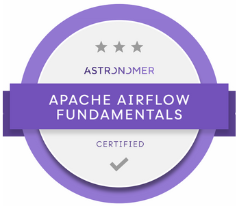

# Airflow Fundamentals - Astronomer Certification (Study Notes and Practices)

  

## Contents
- [The Basics](/fundamentals/study-notes/basics.md)
- [Interacting with Airflow](/fundamentals/study-notes/interacting.md)
- [Playing with DAGs and Tasks: code details](/fundamentals/study-notes/playing-with-dags.md)
- [The Executors](/fundamentals/study-notes/executors.md)
