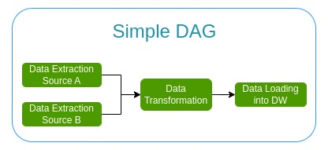

# The Basics

[back to fundamentals page](https://github.com/KattsonBastos/astro-airflow-certification/tree/main/fundamentals)

&ensp;&ensp;&ensp;&ensp;Let's get started with the essentials on Airflow's architecture and components, core concepts, and much more.

## Contents 
- <a href="#why">Why to use Airflow and why to use it instead of Cron Jobs (or any other)?</a>
- <a href="#benefits">Airflow and its Benefits</a>
- <a href="#airflow-not">What Airflow is not</a>
- <a href="#components">Airflow Core Components</a>
- <a href="#architecture">Architecture: components working together</a>
- <a href="#concepts">Core concepts we need to know </a>
- <a href="#lifecycle">The lifecycle of a Task</a>
- <a href="#extras-providers">Extras and Providers </a>

---

  
## Why to use Airflow and why to use it instead of Cron Jobs (or any other)? 

[back to contents](#contents)

&ensp;&ensp;&ensp;&ensp;To answer that questions, let's image we are working on an ETL pipeline, extracting data from an API, transforming them with Dbt, and, finally, loading them into a database. What would happen if the request to the API fails? Or if the database goes down? If we have just a few pipelines to manage, it becomes simple to deal with those exceptions. Even so, having an easier way to rerun our pipeline would be very helpful.

&ensp;&ensp;&ensp;&ensp;The thing is many times we have to build a lot of different and independent data pipelines in which they require different components, dependencies, and data sources/destinations. So, the question is: without an orchestration tool, would we be able to handle all exceptions that could come in? Even if we would, is that worth the time? Most of the times the answer is 'no'.

&ensp;&ensp;&ensp;&ensp;That's where Airflow comes in: it helps us with the orchestration of the workflow. However, we have many other options to use, such as Cron jobs, so, why to choose Airflow in the case of data pipelines? 

&ensp;&ensp;&ensp;&ensp;Well, each tool has its advantages and disadvantages. In the case o Cron, it can't handle complex dependencies between tasks, it doesn't allow us to automatically monitor our tasks or to rerun our tasks after some failure.

---

  
## Airflow and its Benefits  

[back to contents](#contents)
  
  

&ensp;&ensp;&ensp;&ensp;According to <a href="https://airflow.apache.org/docs/apache-airflow/stable/index.html">the documentation</a>, Airflow is a platform (and open-source) used for workflow's <strong>development, scheduling, and monitoring</strong>. In addition, it allows us to build workflows connected with many other technologies, such as container's orchestrators and cloud services.

&ensp;&ensp;&ensp;&ensp;A more simple definition is that Airflow is an "orchestrator for creating and executing tasks in the right order, in the right way, and at the right time." (Marc Lamberti in Airflow Fundamentals lectures).

&ensp;&ensp;&ensp;&ensp;We have a lot of benefits when using Airflow in data pipelines. Some of them:

- Dynamic: Airflow is coded in python, so, anything we can do in Python, we can do in our data pipelines.

- Scalable: we can execute as many tasks as we want.

- Interactive: we have three ways to interact with airflow. The first one is the user interface that helps us monitor our Dags; the second is the CLI; the last, a Rest API that allows us to execute specific tasks.

- Extensible: we can customize it as much as we need. In this way, we can create our own pluging and add it to Airflow.

---

  
## What Airflow is not 

[back to contents](#contents)
  

&ensp;&ensp;&ensp;&ensp;It is important to say that Airflow is not a streaming or a data processing framework. Airflow can't be used as Spark for processing terabytes of data or to handle real-time data flow.

&ensp;&ensp;&ensp;&ensp;So, what to do if we have terabytes of data to process? Simple: we just have to trigger a Spark job from Airflow and let it do all the job.

---

  
## Airflow Core Components 

[back to contents](#contents)
  

&ensp;&ensp;&ensp;&ensp;Under the hood, Airflow runs a lot of components:

- Three core components: a Web Server, a Scheduler, and a Metadata Database.
- Two additional components: an Executor and Workers.

&ensp;&ensp;&ensp;&ensp;The first one, the <strong>Web Server</strong>, is a Flask app with Gunicorn that serves the user interface that allows us to monitor our tasks.

&ensp;&ensp;&ensp;&ensp;The second component is the <strong>Scheduler</strong>. The Scheduler is the heart of Airflow. Without it, we won't be able to trigger our workflows.

&ensp;&ensp;&ensp;&ensp;The next one, the <strong>Metadata Database</strong>, is a component that stores all data related to users, jobs, variables, and connections (among many others). But what databases could we use as Airflow metadata storage? We could use any one that is compatible with Sqlalchemy, such as Postgres and MySql.

&ensp;&ensp;&ensp;&ensp;In order to define how our tasks are going be executed, Airflow has an <strong>Executor</strong> component. So, we have specific executors for running tasks on local machines or on a Kubernetes Cluster.

&ensp;&ensp;&ensp;&ensp;Finally, the <strong>Worker</strong> is a process/subprocess where our task is actually going to be executed.

---

  
  
## Architecture: components working together 

[back to contents](#contents)
  

&ensp;&ensp;&ensp;&ensp;There are thounsands of architectures we could use in Airflow, but let's start simple by taking a look at two types: one node and multi node architectures.

### Single Node: the simplest architecture we can have

&ensp;&ensp;&ensp;&ensp;In this architecture, all Airflow components run on the same machine. However, how they work together? It's simple:

1. First, the Web Server interacts with the Metadata Store. It fetches all the data it needs from the metastores: data from tasks, users, permissions, connections.
2. If a task is ready to be scheduled, the Scheduler changes it state in the Metastore, create an object of that task and sends it into the queue of the Executor.
3. The Executor interacts with the Metastore in order to update task's state once it's done.

&ensp;&ensp;&ensp;&ensp;Here we see the importance of the Metastore since all other components interact with it. Also, the Web Server interacts directly only with the Metastore.

### Multi Nodes: scaling up Airflow

&ensp;&ensp;&ensp;&ensp;In a scenario where we want to execute as many tasks as we would want, a very simple architecture could not be able to handle it. Then, we would need to set up a new architecture and, more specifically, a multi node architecture.

&ensp;&ensp;&ensp;&ensp;In this case, we could keep the components separatelly in different nodes, specially the workers, where the task is processed.

&ensp;&ensp;&ensp;&ensp;So, we could keep the Web Server, the Scheduler and the Executor in one node, and the Metastore and the Queue in a second node, separating it from the Executor.

&ensp;&ensp;&ensp;&ensp;In this case:

1. The Web Server still interacts with the Metasore..
2. The Scheduler interacts with the Metastore to change the task state. Once a task is ready to run, it creates an object of that task and sends it to the Executor.
3. The executor sends the task it received from the Scheduler to the Queue.
4. Once the task is in the Queue, it is ready to be pull and executed by one of the workers.

&ensp;&ensp;&ensp;&ensp;The idea of having separate nodes for the workers is to gain the ability to scale down and up our processing capacity: if we need to execute more tasks, we can raise up more nodes to process them.

---

  
## Core concepts we need to know
  
[back to contents](#contents)

&ensp;&ensp;&ensp;&ensp;In order to fully understand Airflow, we have to know some important concepts.

### DAG - Directed Acyclic Graph

&ensp;&ensp;&ensp;&ensp;In Airflow, when we create a data pipeline, we are actually creating a DAG. A DAG is simply a collection of all tasks (the workflow) defined as a graph. The dependency between the tasks must be acyclic, not cyclic (it is not possible ot have loops in our DAGs). In the image above, for example, the data transformation is only executed when both data extractions are done.

&ensp;&ensp;&ensp;&ensp;
The idea of a DAG is to wrap up all of our tasks, the relationship between them, and their depencencies.

### Operators

&ensp;&ensp;&ensp;&ensp;An Operator is a task in our DAG: whenever we define a operator, we are creating a task. In this way, they define what is going to be executed: a bash command, a python function, a SQL query, among many others. For each task we want to run in our pipeline, we instantiate an Operator.

&ensp;&ensp;&ensp;&ensp;There are three types of Operators: <strong>Action</strong>, <strong>Transfer</strong> and <strong>Sensor</strong>:

- Action Operators: allows us to execute something, such as a python script, a bash command, or a SQL query.
- Transfer Operator: allows us to transfer data from a source to a destination.
- Sensor Operator: usefull when we want to wait for something to happen before moving to the next task. For example, if we want to wait for a file to be loaded in to a S3 storage to, then, download that file with a task, we could use a File Sensor Operator.

### Tasks

&ensp;&ensp;&ensp;&ensp;A Task is basically an instance of an Operator. Once it is ready to be scheduled, it becomes a Task Instance Object: it represents a specific run of a task -> DAG + Task + point in time.

### Dependencies

&ensp;&ensp;&ensp;&ensp;It is relationships between tasks. With dependencies, we can set upstream and downstream tasks dependencies.

### Workflow

&ensp;&ensp;&ensp;&ensp;A Workflow is the combination of all concepts we saw before.

---

  
  
## The lifecycle of a Task 

[back to contents](#contents)

&ensp;&ensp;&ensp;&ensp;The above image represents the lifecycle of a task in Airflow. We can summarize it as follows:

1. We start by creating a data pipeline in a file (we call it dag.py) and then adding it to a folder where we store all of our DAGs.
2. Once the file is created, it will be parsed by both the Web Server and the Scheduler. By default, the Web Server searches for DAGs in the folder for every 30 seconds, while the Scheduler searches for every five minutes.
3. Once the DAG is parsed by both components, The Scheduler checks if the DAG is ready to be triggered and, if so, it creates a Dag Run Object (an instance of our DAG) into the Metastore. However, since the DAG hasn't run yet, there's no info status. 
4. In this case, with the task ready to be triggered, it is created a Task Instance object with the state **"scheduled"**. Then, the Scheduler sends the task to the Executor and, now, its status becomes **"queued"**. Once the task is queued, the Executor takes that task and execute it into a worker, changing it status to **"running"**.
5. Once the task is finished, the Executor updates it status to **"success"** in the Metastore if no failures has occurred.
6. In the end, the Web Server updates the UI.

---

  
## Extras and Providers 

  
[back to contents](#contents)

  

&ensp;&ensp;&ensp;&ensp;Airflow's installation brings us only what we need to get started building our DAGs. For example, if we need to send an email after a task has finished, Airflow already brings that as a core functionality. However, most of the times, we need some additional functionalities, regarding both to Airflow's settings and to our DAG execution. That's where **Extras** and **Provicers** come in.

### Extras

&ensp;&ensp;&ensp;&ensp;Extras are like a big package that install all dependencies needed by the functionality we want. Once we install an Extra, the Airflow's Core is extended (the new Extra functionality becomes part of the Airflow's Core we have installed). For example, we could need a password authentication for users. In this case, we would need to install a password Extra. According to <a href="https://airflow.apache.org/docs/apache-airflow/stable/extra-packages-ref.html">the documentation</a>, Extras don't usually install Providers, except by the "celery" and "cncf.kubernetes" extras, where in this is case they install some necessary Python dependencies for the respective provided package.

### Providers

&ensp;&ensp;&ensp;&ensp;Providers add functionalities on top of Airflow, but they is entirely separated from hhe Airflow Core. That means a Provider can be updated without having to wait for an update in Airflow. For example, if our pipeline needs to connect to a Postgres database, it won't find the connection by default along with Airflow. So, in this case, we would need to install the Postgres Provider.

  
---
[back to contents](#contents)
