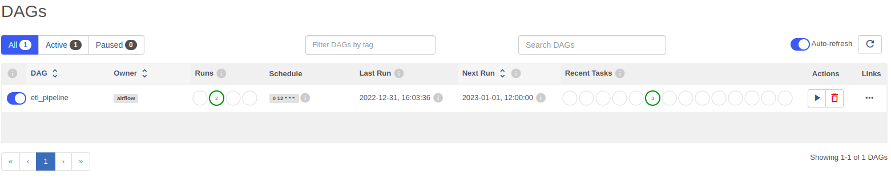
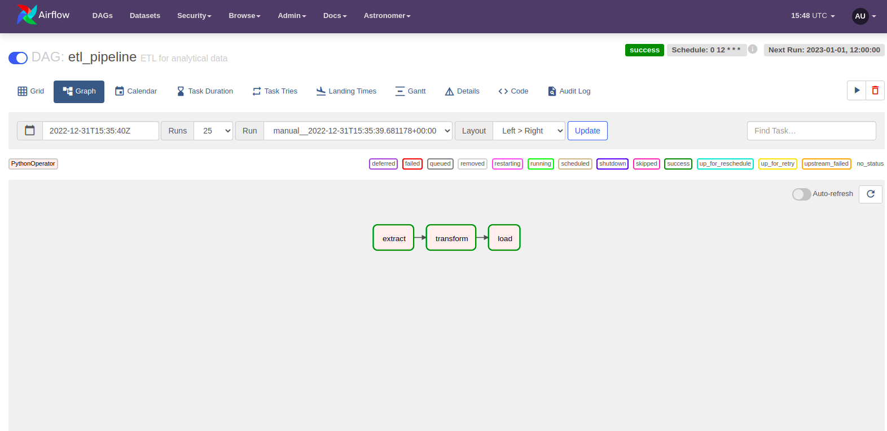
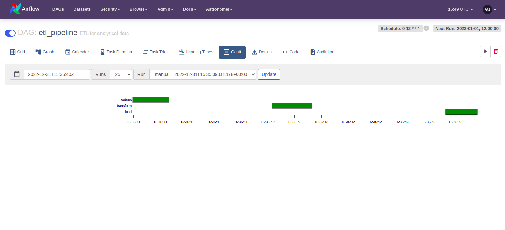

# Interacting with Apache Airflow

## Contents 
- <a href="#3-ways">Three ways to interact with Airflow</a>
- <a href="#ui">Diving into the Airflow UI</a>
- <a href="#cli">Important CLI Commands to know</a>
- <a href="#rest">A little more about the Airflow REST API</a>

---

## Three ways to interact with Airflow

[back to contents](#contents)

&ensp;&ensp;&ensp;&ensp;There are three difference ways we can interact with Apache Airflow: User Interface, Command Line Interface, and a Rest API. So, let's take a brief look at them.

### User Interface (UI)

&ensp;&ensp;&ensp;&ensp;Airflow's UI allows us to manage and monitor our pipelines: checking logs, get the history of dag runs, and so on. The UI allows us to monitor our DAGs in many different ways: Graph View, Grid View, Calendar View, Code View. We'll take a better look at them later.

### Command Line Interface (CLI)

&ensp;&ensp;&ensp;&ensp;Most of the times we are going to use the UI for interaction. But there are some special cases when we need to use the CLI. According to <a href="https://airflow.apache.org/docs/apache-airflow/1.10.2/cli.html">the docs</a>, Airflow CLI allows many types of operations: to start some service; supporting developments; testing a DAG. Besides that, we also need the CLI when we need to update Airflow and to initialize Airflow.

### REST API

&ensp;&ensp;&ensp;&ensp;When we need to build something on top or Airflow, its REST API becomes very useful. Also, it allows us to trigger DAGs, pass arguments to them, and a lot more benefits

---

## Diving into the Airflow UI

[back to contents](#contents)

&ensp;&ensp;&ensp;&ensp;Important: depending on your Airflow version, the following notes and images could be different from your UI. 

### DAG View

&ensp;&ensp;&ensp;&ensp;Once we are logged in Airflow, the first view is the DAGs View. It lists all DAGs we have in our DAGs folder. Besides that, it brings a lot of information, such as the datetime of the last run, the schedule, allows us to trigger the DAG, and so on.

&ensp;&ensp;&ensp;&ensp;The image above shows us a DAGs View with an example DAG - etl_pipeline. Inthat view, we have:

1. A toggle (to the left of the DAG's name): it defines whether of not the DAG is ready to be scheduled. It's important to keep it activated even if we only want to manually trigger the DAG.
2. The name of the DAG: the name that appears there is the name we wsetted shen creating it.
3. Owner: usually, we put unique names to the owner. It is useful to prevent users from running tasks from a specific owner.
4. Runs: it allows us to see the status of current and past runs. Respectivelly, those four circles shows the status:  queued, success, running, failed.
5. Scheduling interval: the time interval at which our DAG is triggered.
6. Last Run: execution date when our DAG was triggered for the last time (the beginning of the scheduling period).
7. Next Run: the expected date and time of the next run.
8. Recent Tasks Status: status for all active DAGs, or for the most recent runs.
9. Actions: allows us to manually trigger or to remove a DAG. The deletion does not delete the file that contains our DAG, it only delete the metadata related to our DAG.
10. Lastly, the Links: it allows us to have specific views and details of a DAG.

### Tree View and Grid View

&ensp;&ensp;&ensp;&ensp;Tree View allows us to see the history of execution of the current DAG along with the status of each task

&ensp;&ensp;&ensp;&ensp;Here, the circles corresponds to the dag and the squares to the tasks. Once a DAG is started, we can follow its status progress in this view.

&ensp;&ensp;&ensp;&ensp;In version 2.3, this view was replaced by a Grid View, which can do more things and brings us a lot more information.

&ensp;&ensp;&ensp;&ensp;On the left, we have somthing similar to the Tree, but now, for each task, we also have its duration. On the right, the display will change dependening on our interaction: by default, it shows the DAG details, such as the total of success and failures, first run, and etc.; if we click on some of that execution bar, it will display the execution details; and, if we click on a specific status box of a task instance, it will display the task details, such as the used Operator, last and next run.

### Graph View

&ensp;&ensp;&ensp;&ensp;In order to have a most comprehensive view of the tasks, Airflow has a graph that shows all dependencies between tasks and their current stauts for a specific run (usually, the latest).

&ensp;&ensp;&ensp;&ensp;In the image above, we can see a simple ETL pipeline in which each task has a success status, and we can clearly see the dependencies between them. Each rectangle corresponds to one task and its fill color will depend on the Operator type, while its border color will depend on the task status.

&ensp;&ensp;&ensp;&ensp; Also, when we hover any of the tasks, it will show some task details, as well as the next tasks that will be executed.

&ensp;&ensp;&ensp;&ensp;Even though Airflow brings the latest run, we're still able to change to another DAG run just by selecting the execution in the filter menu.

### Grantt View

&ensp;&ensp;&ensp;&ensp;Grantt is an important view since it allows us to analyze the task duration as well as overlaps between tasks. So, we can identify bottlenecks and tasks that takes to much to run.

### Interacting with tasks

&ensp;&ensp;&ensp;&ensp;When we click on some task instance, it will open a task interactions just like the image above that brings both task details and actions we can perform. Let's take a quickly look at some of those options:

1. Instance Details: bring some details about the task, such as the run duration, next run, metadata, and so on.
2. Rendered: allows us to see the output of the data we injected in our task.
3. Log: an extremely important option. It allows us to see all logs of our task, such as outputs, whether or not it was marked as SUCCESS, as well as many other information.
4. All Instances: allows us to see all instancees of this tasks for all other DAG runs (that means, for all executions).
5. Filter Upstream: allows to filter in the Grantt View only the selected task and its upstream tasks.
6. Tasks Actions:
    - Run: allows us to run our task if we are using celery or kubernetes executor.
    - Clear: it is important when we have a task failure. In this scenario, afeter fixing the error, we can just clear in order to restart the task (retry).
    - Mark Failure and Mark Success: to manually change the task status. They are usefull when we want to analyze how any other task behave when we have a failure or a success.

---

## Important CLI Commands to know

[back to contents](#contents)

&ensp;&ensp;&ensp;&ensp;The CLI helps us to execute some actions that are not available in the UI or in a scenario where we can't access the UI for some reason.

<table class="tg">
<thead>
  <tr>
    <th class="tg-pqre">Command</th>
    <th class="tg-oj4h">Description</th>
  </tr>
</thead>
<tbody>
  <tr>
    <td class="tg-f4iu">airflow db init</td>
    <td class="tg-f4iu">It allows us to both initialize the Database in Airflow and to create the needed files.</td>
  </tr>
  <tr>
    <td class="tg-f4iu">airflow db upgrade</td>
    <td class="tg-f4iu">Upgrade the schema of the Metadata.</td>
  </tr>
  <tr>
    <td class="tg-f4iu">airflow db reset</td>
    <td class="tg-f4iu">Remove everything in the database (not recommended for production environments).</td>
  </tr>
  <tr>
    <td class="tg-rg0h">airflow webserver</td>
    <td class="tg-rg0h">Start the Web Server.</td>
  </tr>
  <tr>
    <td class="tg-rg0h">airflow scheduler</td>
    <td class="tg-rg0h">Start the Scheduler.</td>
  </tr>
  <tr>
    <td class="tg-rg0h">airflow celery worker</td>
    <td class="tg-rg0h">Start the Celery Worker.</td>
  </tr>
  <tr>
    <td class="tg-rg0h">airflow dags pause/unpause [dag_id]</td>
    <td class="tg-rg0h">Turn on/off the DAG.</td>
  </tr>
  <tr>
    <td class="tg-rg0h">airflow dags trigger [dag_id]</td>
    <td class="tg-rg0h">Trigger the given DAG.</td>
  </tr>
  <tr>
    <td class="tg-rg0h">airflow dags list</td>
    <td class="tg-rg0h">List all DAGs we have in AIrflow.</td>
  </tr>
  <tr>
    <td class="tg-rg0h">airflow task list [dag_id]</td>
    <td class="tg-rg0h">List all tasks of a DAG.</td>
  </tr>
  <tr>
    <td class="tg-rg0h">airflow tasks test [dag_id] [task_id] [execution_date_or_run_id]</td>
    <td class="tg-rg0h">Execute a specific task without checking its dependencies or recording its state in the database.</td>
  </tr>
  <tr>
    <td class="tg-rg0h">airflow dags backfill -s [start_date] -e [end_date] [dag_id]</td>
    <td class="tg-rg0h">Rerun past DAGs.</td>
  </tr>
</tbody>
</table>

---

## A little more about the Airflow REST API

[back to contents](#contents)

&ensp;&ensp;&ensp;&ensp; Airflow 2.0 version brought a stable REST API that we can now definitely use it in production. All the references of this version can be found in the <a href="https://airflow.apache.org/docs/apache-airflow/stable/stable-rest-api-ref.html">Airflow Documentation for the Stable REST API</a>. The reference brings descriptions for everything we need to interact with the API: endpoints, authentication, CRUD operations, and so on.

&ensp;&ensp;&ensp;&ensp;With that API, we can build new tools on top of Airflow as well as interacting with Airflow through other tools as long as we're able to send requests.

