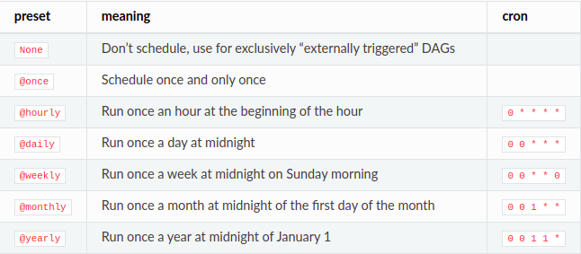

# Playing with DAGs and Tasks: code details

<p align="justify">
&ensp;&ensp;&ensp;&ensp;In this section we're going to take a little look at some DAG Python code, addressing some scheduling and dates concepts, operators, and data exchange between tasks.
</p>

<p id="contents"></p>

## Contents 

- <a href="#struct">Basic Structure of a DAG</a>
- <a href="#dates">Start Date and Scheduling Interval</a>
- <a href="#bf">Backfilling</a>
- <a href="#ops">Some Important Operators</a>
- <a href="#deps">Defining Dependencies Between Tasks</a>
- <a href="#excg">Exchanging Data Between Tasks</a>

---
<p id="struct"></p>

## Basic Structure of a DAG

[back to contents](#contents)


<p align="justify">
&ensp;&ensp;&ensp;&ensp;The first thing we have to do is to create a file which will contain our DAG. Once created in the right folder (as we saw before), we are able to start coding our pipeline. However, there are some different ways to instantiate our DAG and its tasks. Let's take a look at them.
</p>

<p align="justify">
&ensp;&ensp;&ensp;&ensp;Imagine we want to create a simple ETL pipeline. In this case, we'll have to perform at least three tasks: extract the data, transform the data, and load the data.
</p>

<p align="justify">
&ensp;&ensp;&ensp;&ensp;To do so, we can create our DAG in two different ways. THe snippet above shows the first one:
</p>

```python
from airflow import DAG

# instantiating the DAG
dag = DAG(...) # inside the parentheses will come the parameters

# task 1
extract = Operator(dag=dag, ...)

# task 3
transform = Operator(dag=dag, ...)

# task 3
load = Operator(dag=dag, ...)

```

<p align="justify">
&ensp;&ensp;&ensp;&ensp;In this code, we instantiated our DAG by creating the dag object and then, when creating the tasks, we passed that object as an argument to the dag parameters (in this case, our object has the same name, but it could be any other).
</p>

<p align="justify">
&ensp;&ensp;&ensp;&ensp;However, there is a better and cleaner way to instantiate our DAG objects:
</p>


```python
from airflow import DAG

with DAG(dag_id="etl_pipeline") as dag:
    extract = Operator(...)
    transform = Operator(...)
    load = Operator(...)

```

<p align="justify">
&ensp;&ensp;&ensp;&ensp;Now it is clear that all tasks belong to the DAG. Since it brings a more clean code, we'll keep instantiating DAGs in this way in the following.
</p>


<p align="justify">
&ensp;&ensp;&ensp;&ensp;In order to actually create a (runnable) DAG, we need to put some parameters to those classes. The first one (an extremely important one) is the <strong>dag_id</strong>. The dag_id is a unique (across all of our DAGs) identifier of our DAG. The id, usually a String, is the id we'll be able to identify the task in the UI.
</p>

<p align="justify">
&ensp;&ensp;&ensp;&ensp;In the following sections we'll take a look at some other important parameters.
</p>


---
<p id="dates"></p>

## Start Date, Execution Date, Scheduling Interval, and End Date

[back to contents](#contents)


<p align="justify">
&ensp;&ensp;&ensp;&ensp;Two of the most important parameters to set up our DAG is the initial date it starts being scheduled and the time interval at which it gets triggered. Let's take a little look on them, but first let's imagine we want to run a daily ETL pipeline and this run will start at 2023/01/01 00:00.
</p>

<p align="justify">
&ensp;&ensp;&ensp;&ensp;The start date can be any date in the past or in the future. Basically, we can think of it as the initial date of the data interval we want to process in our pipeline. Taking our above example, the start date is 2023/01/01 00:00.
</p>

<p align="justify">
&ensp;&ensp;&ensp;&ensp;The scheduling interval defines the interval at which our DAGs gets (in our example, a 24h interval). The interval can be in seconds, minutes, hours, and so on. A DAG may or may not have a scheduling interval.
</p>

<p align="justify">
&ensp;&ensp;&ensp;&ensp;The thing is that Airflow won't trigger our dag at the start date, but only when the start date plus the scheduling interval have elapsed. So, if our start date is setted to 2023/01/01 00:00 and we setted a daily interval, our DAG is effectively triggered at 2023/01/02 00:00 (one day elapsed) and then it will process all data from the start date.
</p>

<p align="justify">
&ensp;&ensp;&ensp;&ensp;Finally, the End Date is used to pass a date we don't want to trigger our DAG anymore after it.
</p>

<p align="justify">
&ensp;&ensp;&ensp;&ensp;Until now we saw the concepts, but let's take a look at the code level.
</p>

### Start date in code

<p align="justify">
&ensp;&ensp;&ensp;&ensp;In Airflow we can specify a start date both in the DAG level or in a task (operator) level. If we apply in the DAG, it will be applying to all tasks (operators) in the DAG. However, specifying it directly in the task is not a common use since we can have an execution mess between the tasks dates.
<br>

&ensp;&ensp;&ensp;&ensp;In order to pass a date in Airflow DAG, we need a datetime object. So, we just have to import the built in python datetime object and pass a datetime to the start_date DAG's parameter:
</p>

```python
from airflow import DAG

from datetime import datetime

with DAG(
    dag_id="etl_pipeline",
    start_date=datetime(2023,1,1)
) as dag:

    extract = Operator(
        task_id='extract'
    )

```

<p align="justify">
&ensp;&ensp;&ensp;&ensp;By default, all dates in Airflow is stored in UTC, which is recommended since it can avoid timezones problems. So, it's up to us to manage the timing in order to start scheduling our DAGs in the desired datetime.
</p>

<p align="justify">
&ensp;&ensp;&ensp;&ensp;There still are two important things to to keep in mind. First, by default, if we specify a start date in the past, Airflow will trigger all runs between that date and the current date. In order to deal with this behavior, we have to specify some parameters (we'll see them in the next section).
<br>

&ensp;&ensp;&ensp;&ensp;Secondly, it is recommended to set a fixed start date time intead of a dinamically one (it is not a good idea to use datetime.now()). That's because, as we saw before, the DAG is triggered only when the start_date + scheduling_interval has elapsed. It turns out that if we use datetime.now(), the start_date constantly changes and, then, the time to trigger the DAG never comes. SO, we end up with a DAG that never get triggered.
</p>


### Scheduling interval in code


<p align="justify">
&ensp;&ensp;&ensp;&ensp;The scheduling interval is as easier as the start date to be specified: we just have to pass the value to the schedule_interval. This value can be both a cron expression or a timedelta python object. Airflow already brings us some pre defined crons. The image bellow shows some Airflow's 'preset' crons as long as its respective cron tab expression.
</p>



<p align="justify">
&ensp;&ensp;&ensp;&ensp;So, if we want to specify a daily trigger to our DAG, we jsut have to do the following:
</p>


```python
from airflow import DAG

from datetime import datetime

with DAG(
    dag_id="etl_pipeline",
    start_date=datetime(2023,1,1),
    schedule_interval='@daily'
) as dag:

    extract = Operator(
        task_id='extract'
    )

```

<p align="justify">
&ensp;&ensp;&ensp;&ensp;If we want to use timedelta instead of a cron expresson, we can simply pass it as argument:
</p>

```python
from airflow import DAG

from datetime import datetime

with DAG(
    dag_id="etl_pipeline",
    start_date=datetime(2023,1,1),
    schedule_interval=timedelta(days=1)
) as dag:

    extract = Operator(
        task_id='extract'
    )

```

<p align="justify">
&ensp;&ensp;&ensp;&ensp;But what's the difference between cron and timedelta? Well, cron expressions are absolute. That means if we specify that we want to run our dag at 10 AM, it will be triggered at 10 AM. The timedelta is relative: if we specify we want to run our DAG with a timedelta(hours=10), it will be triggered every 10 hours starting from the previsous execution date.
</p>

<p align="justify">
&ensp;&ensp;&ensp;&ensp;The last thing to keep in mind about the Airflow Scheduling Interval is the ability to pass a None value to the parameters. By doing so, our DAG will never be automatically triggered by the Scheduler, it will be triggered or manually or by an external application.
</p>


---
<p id="bf"></p>

## Backfilling

[back to contents](#contents)

<p align="justify">
&ensp;&ensp;&ensp;&ensp;The backfilling process allows us to run/rerun past non-triggered or already triggered DAGs. Airflow by default triggers all non triggered DAG runs. Imagine we specified a start date starting two years ago. By default, Airflow will trigger all runs from that date until now.
</p>

<p align="justify">
&ensp;&ensp;&ensp;&ensp;To manage this behavior, we can use the catchup parameter (which is setted to True by default):
</p>

```python
from airflow import DAG

from datetime import datetime

with DAG(
    dag_id="etl_pipeline",
    start_date=datetime(2023,1,1),
    schedule_interval=timedelta(days=1),
    catchup=False

) as dag:

    extract = Operator(
        task_id='extract'
    )

```


<p align="justify">
&ensp;&ensp;&ensp;&ensp;Even though in the above example catchup is setted to False, we're also able to backfill our DAG through the CLI by running
</p>

```bash
airflow dags backfill -s [start_date] -e [end_date] [dag_id]

```

---
<p id="ops"></p>

## Some Important Operators

[back to contents](#contents)

<p align="justify">
&ensp;&ensp;&ensp;&ensp;In Airflow, an Operator is basically a task. That is, it becomes a task in our pipeline. There are some things to keep in mind about operators. It is not recommended to put two tasks in the same operator. Imagine we have two tasks: load and transform the data. If we put them in the same operator and one of them fail, we'll have to retry both tasks, wasting time and resources. In this way, we could create two operators and manage them separately.
</p>

<p align="justify">
&ensp;&ensp;&ensp;&ensp;Another important concept to remember is that our operator must be idepotent: for a given input, is must return the same output whenever we run the task. This is important because most of the times we're retrying the tasks, running past tasks, and so on.
</p>

<p align="justify">
&ensp;&ensp;&ensp;&ensp;Additionally, the task_id of an operator must be unique across the DAG.
</p>

<p align="justify">
&ensp;&ensp;&ensp;&ensp;Lastly, Airflow brings some parameters we can specify in the operator in order to manage the task retry. The first is the retry parameters. With it, we can specify how many retries we want for a specific task. The second is the retry delay, that allows us to specify the delay between retries:
</p>

```python
from airflow import DAG

from datetime import datetime

with DAG(
    dag_id="etl_pipeline",
    start_date=datetime(2023,1,1),
    schedule_interval=timedelta(days=1),
    catchup=False

) as dag:

    extract = Operator(
        task_id='extract',
        retry=3,
        retry_delay=timedelta(minutes=30)
    )

```

### Automatic Operator Arguments

<p align="justify">
&ensp;&ensp;&ensp;&ensp;If we're using the same arguments in many arguments, it is a good option to define a dictionary with the parameters we want to apply to all of them and pass it to the default_args parameter in the DAG:
</p>

```python
from airflow import DAG

from datetime import datetime

default_args = {
    'retry': 3,
    'retry_delay': timedelta(minutes=30)
}


with DAG(
    dag_id="etl_pipeline",
    start_date=datetime(2023,1,1),
    schedule_interval=timedelta(days=1),
    catchup=False,
    default_args=default_args

) as dag:

    extract = Operator(
        task_id='extract'
    )

    transform = Operator(
        task_id='transform'
    )

```

<p align="justify">
&ensp;&ensp;&ensp;&ensp;In the above example, all default arguments will be applied to those two operators. However, if we want a specific task to have a different behavior (let's say, a retry=10), all we have to do is to specify it in the operator: specifying in the operator have a priority over the default args.
</p>

<p align="justify">
&ensp;&ensp;&ensp;&ensp;In Airflow, we have a lot of operator for a bunch of things. Let's take a little look at three of them.
</p>

### The Python Operator

<p align="justify">
&ensp;&ensp;&ensp;&ensp;One of the most commonly used operator in Airflow. It allows us to run python callable functions. The following snippet shows the PythonOperator use:
</p>


```python
from airflow import DAG
from airflow.operators.python import PythonOperator

from datetime import datetime

default_args = {
    'retry': 3,
    'retry_delay': timedelta(minutes=30)
}

def _data_extraction():
    pass

with DAG(
    dag_id="etl_pipeline",
    start_date=datetime(2023,1,1),
    schedule_interval=timedelta(days=1),
    catchup=False,
    default_args=default_args

) as dag:

    extract = PythonOperator(
        task_id='extract',
        python_callable=_data_extraction
    )

```

<p align="justify">
&ensp;&ensp;&ensp;&ensp;We must pass what function we want to run. In example, we created a data extraction function (that doesn't do anything, just to examplify) and we passed it as argument to the python_callable parameter. So, this task is just to eecute that function.
</p>

<p align="justify">
&ensp;&ensp;&ensp;&ensp;An extremelly cool thing we can do with PythonOperator is to pass the dag run context to the python callable function. To do so, we can just edit our function to receive arguments or keyword arguments:
</p>


```python
def _data_extraction(**kwargs):
    print(kwargs['task_id'])
    print(kwargs['dag_run'])
    print(kwargs['ds']) # dag run execution date

```

<p align="justify">
&ensp;&ensp;&ensp;&ensp;Those args brings into the function information about the task id, the dag name, the dag object, and a lot more things. So, if you know Python, you know we could do a lot of thigns with that information.
</p>

<p align="justify">
&ensp;&ensp;&ensp;&ensp;But that's not the only way to pass arguments into a function, we can also pass our own arguments by using the op_kwargs parameter (it receives a dictionary):
</p>

```python
extract = PythonOperator(
    task_id='extract',
    python_callable=_data_extraction,
    op_kwargs={'custom_arg': 'astro'}
)

```

### The File Sensor Operator


<p align="justify">
&ensp;&ensp;&ensp;&ensp;A commonly used case in Airflow is to wait for a file to landing a specific location before moving to the next task. That's what the FileSensor does:
</p>

```python
from airflow import DAG
from airflow.sensors.filesystem import FileSensor

from datetime import datetime


with DAG(
    ...

) as dag:

    waiting_for_data = FileSensor(
        task_id='waiting_for_data',
        fs_conn_id='fs_default',
        file_path='file_name.txt',
        poke_interval=10
    )

    transform = Operator(
        task_id='transform',
        ...
    )

```

<p align="justify">
&ensp;&ensp;&ensp;&ensp;In order to use that sensor, we need to specify a connection id that is needed by the sensor. This connection is created in the UI by going to the Admin -> Connections and add a new connection. We can sensor for files from many source, such is AWS, Azure, local file.
<br>

&ensp;&ensp;&ensp;&ensp;FInally, we pass the file name we want. By default, the sensor check the folder every 30 seconds. TO change this interval, we just have to pass the value to the poke_interval parameter.
</p>


### The Bash Operator

<p align="justify">
&ensp;&ensp;&ensp;&ensp;This is another extremely used operator. The BashOperator allows us to execute bash commands. It is pretty simple to use: we just have to pass the command to the bash_command parameter.
</p>

```python
from airflow import DAG
from airflow.operators.bash import BashOperator

from datetime import datetime


with DAG(
    ...

) as dag:

    hello_astro = BashOperator(
        task_id='hello_astro',
        bash_command='echo hello, astro!'
    )

```

---
<p id="deps"></p>

## Defining Dependencies Between Tasks

[back to contents](#contents)


---
<p id="excg"></p>

## Exchanging Data Between Tasks

[back to contents](#contents)